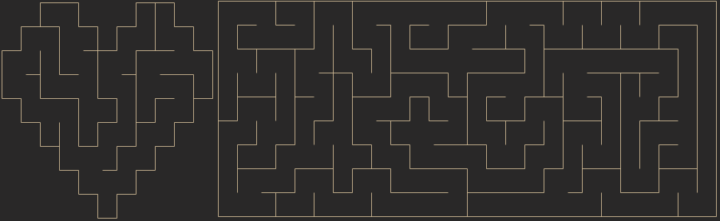

# Backtracking maze generator

## Introduction

This is a backtracking maze generator I remade, the original project was quite convoluted and badly written, so I took the time to make it a better project for me to learn.

It is made in c++, it uses iterative backtracking using a stack and it uses a heap allocatted grid structure, so that means that all the mazes can be as large as you want.

This program can produce any shape of maze, any combination of w*h and also you can add obstacles to change the shape of the maze however you want.

## Screenshots

## How to install

Since this project doesn't have any dependencies, you can just build it using the included makefile, using mingw32-make or make on linux, make sure before building to add the `obj` directory in the `main` directory.

## How to use

You will have to create a `Maze` object, and then you can use the function `generate` which will start generating the maze, it will first choose a random start, and the using the iterative backtracking algorithm will generate the maze.

If you want to change the shape of the maze, you will have the set the obstacles at the start, before calling the `generate` function.

To output the maze, you will have to use `output` and provide a ouput stream and the type of the output, the two types of output being:
- Maze - in which you output the visual maze generated
- Data - in which you output the data

You can also load the data from a file, you will have to have outputed in the file the maze data, and then you can read from the file.

The mazes are stored in hex, the first 2 elements on the first line are the width and height, and then the data begins, being stored in w columns and h rows, the first 4 bits are used to define the walls of the cell, and the 5th bit is used to define if the cell is an obstacle or not.
